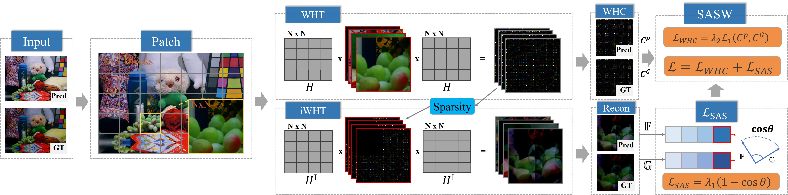
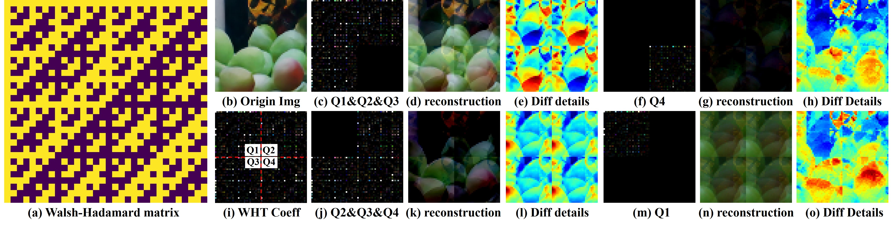
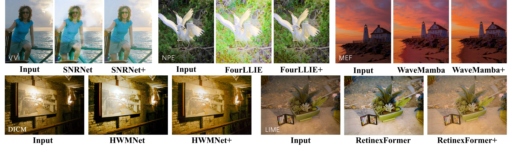
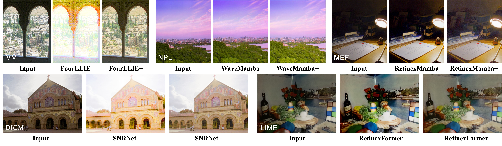
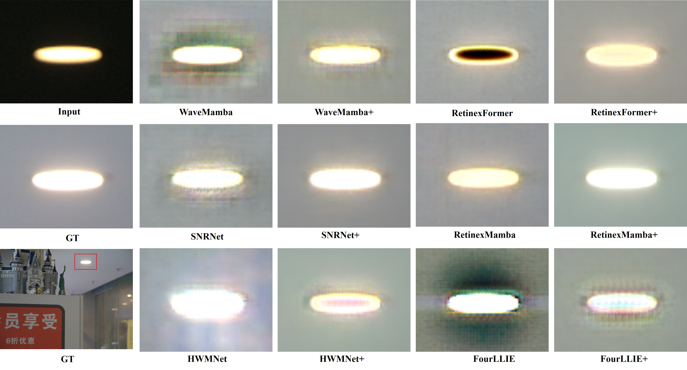
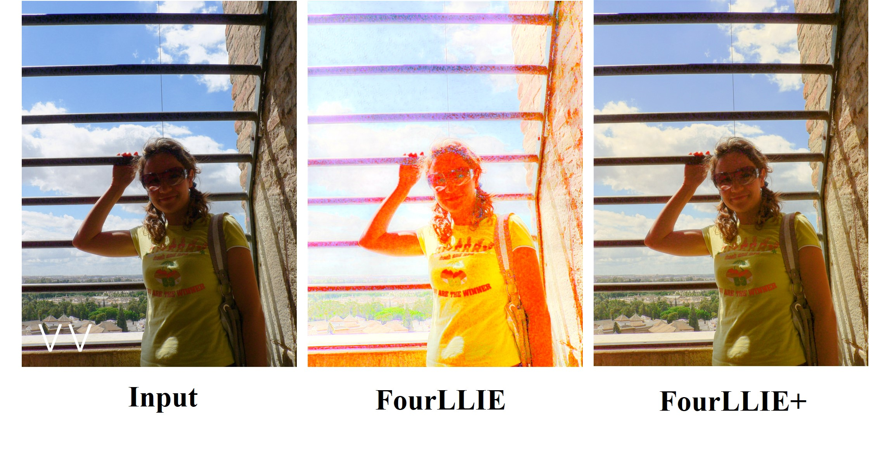
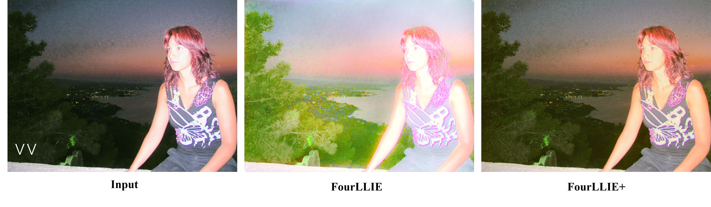
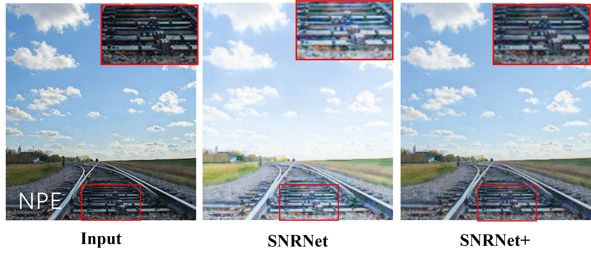
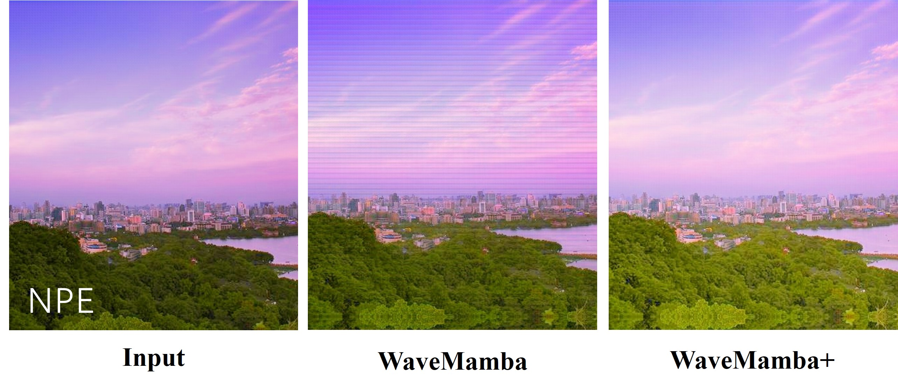

# [ACM MM'25 Oral] A Novel Perspective on Low-Light Image Enhancement: Leveraging Artifact Regularization and Walsh-Hadamard Transform (SASW)    

If you like this work, please give us a star ⭐ on GitHub.

<a href="https://werring.wu.github.io">Weilin Wu*,</a> Shifan Yang, Qizhao Lin, XingHong Chen, Kunping Yang, Jing Wang and Guannan Chen <sup>✉️</sup>
> **Abstract:** *Low-light image enhancement (LLIE) aims to restore low-light images to normal lighting conditions by improving their illumination and fine details, thereby facilitating efficient execution of downstream visual tasks. Traditional LLIE methods improve image quality but often introduce high-frequency artifacts, which are difficult to eliminate, hindering detail recovery and quality enhancement in LLIE.
To solve this problem, we introduce a novel perspective: instead of traditional artifact suppression, sparsification-induced artifacts are repurposed as constructive regularization signals to guide detail recovery. By analyzing the impact of sparsified frequency components and their role in reconstruction artifacts, a detailed mathematical framework is presented. Specifically, we propose a novel loss function SASW-Loss which combining Sparse Artifact Similarity Loss (SAS-Loss) and Walsh-Hadamard Coefficient Loss (WHC-Loss).
SAS-Loss mitigates the over-compensation of missing frequencies, helping the network recover structural details, while WHC-Loss optimizes the frequency-domain representation, restoring luminance, suppressing noise, and enhancing both structure and details. Extensive experiments show that our approach outperforms existing state-of-the-art methods, achieving superior performance in structural detail preservation and noise suppression. These results validate the effectiveness of our new perspective, which leverages sparsification artifacts to guide detail recovery, demonstrating significant improvements and robust performance across multiple models, and opening new avenues for future research.* 
<hr />

## Main FlowChart


## Detail of WHT Generate Artifacts



### Visual Results











## 1. Create Environment

The basic environment configuration can be referred to [RetinexFormer](https://github.com/caiyuanhao1998/Retinexformer), [RetinexMamba](https://github.com/YhuoyuH/RetinexMamba), [HWMNet](https://github.com/FanChiMao/HWMNet), [SNR-Net](https://github.com/dvlab-research/SNR-Aware-Low-Light-Enhance), [WaveMamba](https://github.com/AlexZou14/Wave-Mamba) and [FourLLIE](https://github.com/wangchx67/FourLLIE).

## 2. Prepare Dataset
Download the following datasets:

LOL-v1 [Baidu Disk](https://pan.baidu.com/s/1ZAC9TWR-YeuLIkWs3L7z4g?pwd=cyh2) (code: `cyh2`), [Google Drive](https://drive.google.com/file/d/1L-kqSQyrmMueBh_ziWoPFhfsAh50h20H/view?usp=sharing)

LOL-v2 [Baidu Disk](https://pan.baidu.com/s/1X4HykuVL_1WyB3LWJJhBQg?pwd=cyh2) (code: `cyh2`), [Google Drive](https://drive.google.com/file/d/1Ou9EljYZW8o5dbDCf9R34FS8Pd8kEp2U/view?usp=sharing)

MIT-Adobe FiveK [Baidu Disk](https://pan.baidu.com/s/1ajax7N9JmttTwY84-8URxA?pwd=cyh2) (code:`cyh2`), [Google Drive](https://drive.google.com/file/d/11HEUmchFXyepI4v3dhjnDnmhW_DgwfRR/view?usp=sharing), [Official](https://data.csail.mit.edu/graphics/fivek/)

**Note:** 

(1) Please process the raw images of the MIT Adobe FiveK dataset following [the sRGB output mode](https://github.com/nothinglo/Deep-Photo-Enhancer/issues/38) or directly download and use the sRGB image pairs processed by us in the [Baidu Disk](https://pan.baidu.com/s/1ajax7N9JmttTwY84-8URxA?pwd=cyh2) (code:`cyh2`) and [Google Drive](https://drive.google.com/file/d/11HEUmchFXyepI4v3dhjnDnmhW_DgwfRR/view?usp=sharing)

(2) Please download the `text_list.txt` from [Google Drive](https://drive.google.com/file/d/199qrfizUeZfgq3qVjrM74mZ_nlacgwiP/view?usp=sharing) or [Baidu Disk](https://pan.baidu.com/s/1GQfaQLI6tvB0IrTMPOM_9Q?pwd=ggbh) (code: `ggbh`) and then put it into the folder `data/SMID/SMID_Long_np/`

<details close>
<summary><b> Then organize these datasets as follows: </b></summary>

```
    |--data   
    |    |--LOLv1
    |    |    |--Train
    |    |    |    |--input
    |    |    |    |    |--100.png
    |    |    |    |    |--101.png
    |    |    |    |     ...
    |    |    |    |--target
    |    |    |    |    |--100.png
    |    |    |    |    |--101.png
    |    |    |    |     ...
    |    |    |--Test
    |    |    |    |--input
    |    |    |    |    |--111.png
    |    |    |    |    |--146.png
    |    |    |    |     ...
    |    |    |    |--target
    |    |    |    |    |--111.png
    |    |    |    |    |--146.png
    |    |    |    |     ...
    |    |--LOLv2
    |    |    |--Real_captured
    |    |    |    |--Train
    |    |    |    |    |--Low
    |    |    |    |    |    |--00001.png
    |    |    |    |    |    |--00002.png
    |    |    |    |    |     ...
    |    |    |    |    |--Normal
    |    |    |    |    |    |--00001.png
    |    |    |    |    |    |--00002.png
    |    |    |    |    |     ...
    |    |    |    |--Test
    |    |    |    |    |--Low
    |    |    |    |    |    |--00690.png
    |    |    |    |    |    |--00691.png
    |    |    |    |    |     ...
    |    |    |    |    |--Normal
    |    |    |    |    |    |--00690.png
    |    |    |    |    |    |--00691.png
    |    |    |    |    |     ...
    |    |    |--Synthetic
    |    |    |    |--Train
    |    |    |    |    |--Low
    |    |    |    |    |   |--r000da54ft.png
    |    |    |    |    |   |--r02e1abe2t.png
    |    |    |    |    |    ...
    |    |    |    |    |--Normal
    |    |    |    |    |   |--r000da54ft.png
    |    |    |    |    |   |--r02e1abe2t.png
    |    |    |    |    |    ...
    |    |    |    |--Test
    |    |    |    |    |--Low
    |    |    |    |    |   |--r00816405t.png
    |    |    |    |    |   |--r02189767t.png
    |    |    |    |    |    ...
    |    |    |    |    |--Normal
    |    |    |    |    |   |--r00816405t.png
    |    |    |    |    |   |--r02189767t.png
    |    |    |    |    |    ...

    |    |--SID
    |    |    |--short_sid2
    |    |    |    |--00001
    |    |    |    |    |--00001_00_0.04s.npy
    |    |    |    |    |--00001_00_0.1s.npy
    |    |    |    |    |--00001_01_0.04s.npy
    |    |    |    |    |--00001_01_0.1s.npy
    |    |    |    |     ...
    |    |    |    |--00002
    |    |    |    |    |--00002_00_0.04s.npy
    |    |    |    |    |--00002_00_0.1s.npy
    |    |    |    |    |--00002_01_0.04s.npy
    |    |    |    |    |--00002_01_0.1s.npy
    |    |    |    |     ...
    |    |    |     ...
    |    |    |--long_sid2
    |    |    |    |--00001
    |    |    |    |    |--00001_00_0.04s.npy
    |    |    |    |    |--00001_00_0.1s.npy
    |    |    |    |    |--00001_01_0.04s.npy
    |    |    |    |    |--00001_01_0.1s.npy
    |    |    |    |     ...
    |    |    |    |--00002
    |    |    |    |    |--00002_00_0.04s.npy
    |    |    |    |    |--00002_00_0.1s.npy
    |    |    |    |    |--00002_01_0.04s.npy
    |    |    |    |    |--00002_01_0.1s.npy
    |    |    |    |     ...
    |    |    |     ...
    |    |--SMID
    |    |    |--SMID_LQ_np
    |    |    |    |--0001
    |    |    |    |    |--0001.npy
    |    |    |    |    |--0002.npy
    |    |    |    |     ...
    |    |    |    |--0002
    |    |    |    |    |--0001.npy
    |    |    |    |    |--0002.npy
    |    |    |    |     ...
    |    |    |     ...
    |    |    |--SMID_Long_np
    |    |    |    |--text_list.txt
    |    |    |    |--0001
    |    |    |    |    |--0001.npy
    |    |    |    |    |--0002.npy
    |    |    |    |     ...
    |    |    |    |--0002
    |    |    |    |    |--0001.npy
    |    |    |    |    |--0002.npy
    |    |    |    |     ...
    |    |    |     ...
    |    |--FiveK
    |    |    |--train
    |    |    |    |--input
    |    |    |    |    |--a0099-kme_264.jpg
    |    |    |    |    |--a0101-kme_610.jpg
    |    |    |    |     ...
    |    |    |    |--target
    |    |    |    |    |--a0099-kme_264.jpg
    |    |    |    |    |--a0101-kme_610.jpg
    |    |    |    |     ...
    |    |    |--test
    |    |    |    |--input
    |    |    |    |    |--a4574-DSC_0038.jpg
    |    |    |    |    |--a4576-DSC_0217.jpg
    |    |    |    |     ...
    |    |    |    |--target
    |    |    |    |    |--a4574-DSC_0038.jpg
    |    |    |    |    |--a4576-DSC_0217.jpg
    |    |    |    |     ...


```

</details>

We also provide download links for LIME, NPE, MEF, DICM, and VV datasets that have no ground truth:

[Baidu Disk](https://pan.baidu.com/s/1oHg03tOfWWLp4q1R6rlzww?pwd=cyh2) (code: `cyh2`)
 or [Google Drive](https://drive.google.com/drive/folders/1kEA3kzAVOub0XEoEa5MnlKBy32z6YaBw?usp=drive_link)


&nbsp;                    

## 3. Testing

Download our models from [Baidu Disk](https://pan.baidu.com/s/12EP-EjtVMR3YDarO2NfvtA?pwd=54xn) (code: `54xn`) or [Google Drive](https://drive.google.com/drive/folders/1kEA3kzAVOub0XEoEa5MnlKBy32z6YaBw?usp=drive_link). Any deviation between some weights and the paper’s values stems from better results obtained in later optimizations.
We use RetinexFormer as an example. For other models, please refer to ([RetinexMamba](https://github.com/YhuoyuH/RetinexMamba), [HWMNet](https://github.com/FanChiMao/HWMNet), [SNR-Net](https://github.com/dvlab-research/SNR-Aware-Low-Light-Enhance), [WaveMamba](https://github.com/AlexZou14/Wave-Mamba) and [FourLLIE](https://github.com/wangchx67/FourLLIE).

```shell
# LOL-v1
python3 Enhancement/test_from_dataset.py --opt Options/RetinexFormer_LOL_v1.yml --weights pretrained_weights/LOL_v1.pth --dataset LOL_v1

# LOL-v2-real
python3 Enhancement/test_from_dataset.py --opt Options/RetinexFormer_LOL_v2_real.yml --weights pretrained_weights/LOL_v2_real.pth --dataset LOL_v2_real

# LOL-v2-synthetic
python3 Enhancement/test_from_dataset.py --opt Options/RetinexFormer_LOL_v2_synthetic.yml --weights pretrained_weights/LOL_v2_synthetic.pth --dataset LOL_v2_synthetic

# SID
python3 Enhancement/test_from_dataset.py --opt Options/RetinexFormer_SID.yml --weights pretrained_weights/SID.pth --dataset SID

# SMID
python3 Enhancement/test_from_dataset.py --opt Options/RetinexFormer_SMID.yml --weights pretrained_weights/SMID.pth --dataset SMID

# FiveK
python3 Enhancement/test_from_dataset.py --opt Options/RetinexFormer_FiveK.yml --weights pretrained_weights/FiveK.pth --dataset FiveK
```

## Citation
```
@inproceedings{wu2025sasw,
 title={A Novel Perspective on Low-Light Image Enhancement: Leveraging Artifact Regularization and Walsh-Hadamard Transform},
 author={Weilin Wu and Shifan Yang and Qizhao Lin and XingHong Chen and Kunping Yang and Jing Wang and Guannan Chen},
 booktitle={Proceedings of the 33rd ACM International Conference on Multimedia},
 year= {2025},
 pages={12160--12169},
 doi={10.1145/3746027.3758142}
}
```
## License
This project is released under the MIT license. Please refer to the acknowledged repositories for their licenses.
## Acknowledgement
This project is based on [RetinexFormer](https://github.com/caiyuanhao1998/Retinexformer), [RetinexMamba](https://github.com/YhuoyuH/RetinexMamba), [HWMNet](https://github.com/FanChiMao/HWMNet), [SNR-Net](https://github.com/dvlab-research/SNR-Aware-Low-Light-Enhance), [WaveMamba](https://github.com/AlexZou14/Wave-Mamba) and [FourLLIE](https://github.com/wangchx67/FourLLIE).
